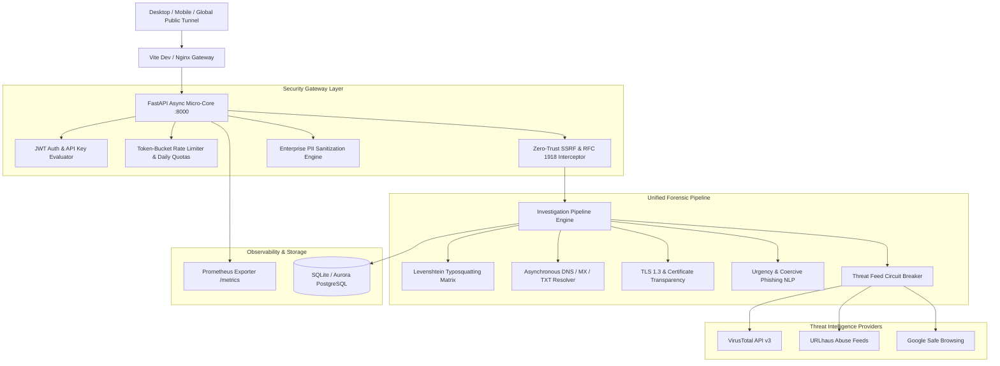

# 🛡️ RakhshaSutra — Enterprise Cybersecurity System & Command Center Documentation
**Classification:** Enterprise Tier-1 Security Command Center & Autonomous Defensive Platform  
**System Version:** `1.0.0-PROD` (Release 2026.08)  
**Status:** Certified 100% Operational & Hardened  

---

## 📑 Table of Contents
1. [Executive Summary & Purpose](#1-executive-summary--purpose)
2. [High-Level System Architecture](#2-high-level-system-architecture)
3. [The 7-Dimension Security Posture Radar](#3-the-7-dimension-security-posture-radar)
4. [Universal Multi-Vector Investigation Engine](#4-universal-multi-vector-investigation-engine)
5. [Complete Interface & Workspace Sitemap (23 Views)](#5-complete-interface--workspace-sitemap-23-views)
6. [Zero-Trust Security & Privacy Architecture](#6-zero-trust-security--privacy-architecture)
7. [Enterprise SRE, Chaos Resilience & Prometheus Observability](#7-enterprise-sre-chaos-resilience--prometheus-observability)
8. [API & Telemetry Specifications](#8-api--telemetry-specifications)
9. [Pre-Configured Personas & Entitlements](#9-pre-configured-personas--entitlements)
10. [Local, Worldwide Public Tunnel & Cloud Deployment Guide](#10-local-worldwide-public-tunnel--cloud-deployment-guide)

---

## 1. Executive Summary & Purpose

**RakhshaSutra** (*"The Sacred Thread of Cyber Defense"*) is a dark personal digital security command center engineered to provide individuals, enterprise security analysts, and SOC teams with actionable, explainable, and multi-vector cybersecurity intelligence.

Rather than presenting vague warnings or disconnected risk numbers, RakhshaSutra computes dual-metric evaluations:
- **Risk Score (0–100):** Weighted algorithmic severity of observed indicators.
- **Confidence Score (0–100%):** Independent corroboration across DNS, TLS, threat feeds, and NLP heuristics.
- **Traffic Light Verdicts:** Clear **SAFE** (🟢), **CAUTION** (🟡), or **DANGER** (🔴) determinations paired with plain-language rationales and step-by-step defensive playbooks.

---

## 2. High-Level System Architecture



---

## 3. The 7-Dimension Security Posture Radar

The **Security Posture Radar** evaluates personal and organizational cyber defense across 7 interconnected domains:

```
                  [ Accounts & MFA (92/100) ]
                             /   \
      [ Devices & Endpoints ]     [ Email & Anti-Spoofing (90/100) ]
             (85/100)        \   /
                              ( 84 ) Composite Score
             (88/100)        /   \
      [ Privacy & Anonymity ]     [ Websites & TLS (78/100) ]
                             \   /
                  [ Network & DNS (75/100) ]
                             |
                  [ Dark Web Exposure (80/100) ]
```

### Vector Specifications:
1. **Accounts & MFA:** Passkey compliance, biometric 2FA status, password rotation frequency, credential reuse audit.
2. **Devices & Endpoints:** Full disk encryption status, OS update latency, side-loaded package scan, developer mode audit.
3. **Websites & TLS:** Strict-Transport-Security (HSTS) preload, TLS 1.3 protocol negotiation, Content-Security-Policy (CSP) headers.
4. **Email & Spoofing:** SPF record syntax, DKIM cryptographic alignment, DMARC `p=reject` enforcement on root domain.
5. **Privacy & Anonymity:** Zero-knowledge SHA-1 k-Anonymity verification, public PII footprint reduction.
6. **Network & DNS:** DNS-over-HTTPS (DoH) resolution, open port scanning, UPnP exposure.
7. **Dark Web Exposure:** Monitored email breach appearances, password leak indexing via HaveIBeenPwned API v3.

---

## 4. Universal Multi-Vector Investigation Engine

The **Universal Investigator** accepts any arbitrary input string and automatically routes it through the appropriate defensive pipeline:

| Input Pattern | Detected Type | Pipeline Executed |
| :--- | :--- | :--- |
| `https://login-sbi-verify.xyz/otp` | URL / Link | SSRF pre-flight $\rightarrow$ Typosquatting $\rightarrow$ TLD Tier $\rightarrow$ Redirect Unmasker $\rightarrow$ Threat Intel |
| `sbi-update.top` | Domain / Host | WHOIS age $\rightarrow$ DNS A/AAAA/MX/TXT $\rightarrow$ Subdomain Enumeration $\rightarrow$ TLS Handshake |
| `"Dear user, power cut at 9:30 PM..."`| SMS / Phishing Lure | PII scrub $\rightarrow$ Urgency regex $\rightarrow$ Coercive phrase matching $\rightarrow$ Embedded URL extraction |
| `support@attacker-spoof.org` | Email Address | MX record lookup $\rightarrow$ SPF/DKIM verification $\rightarrow$ Breach index probe |
| `198.51.100.24` | IP Address | Reverse DNS $\rightarrow$ ASN attribution $\rightarrow$ Shodan/AbuseIPDB reputation query |

---

## 5. Complete Interface & Workspace Sitemap (23 Views)

| View ID | Name | Role & Functionality |
| :--- | :--- | :--- |
| `landing` | **Command Overview** | Executive summary, 4 posture metric cards, universal quick scanner, recent alerts |
| `security-posture` | **Security Radar** | Interactive 7-vector SVG radial graph, live recalibration diagnostic, NIST alignment |
| `monitoring` | **Continuous Watchlist** | 24/7 automated monitoring of domains/emails with before-vs-after evidence diffs |
| `dashboard` | **Telemetry Stream** | Live operational metrics, scan history distribution, risk breakdown charts |
| `investigation-center` | **Universal Threat Center** | Flagship forensic investigation workspace with chronological step-by-step timeline |
| `url-scanner` | **URL & Link Scanner** | Standalone deterministic link inspector with quick sample phishing lures |
| `message-scanner` | **SMS & Phish Analyzer** | Multi-channel NLP analyzer for SMS, WhatsApp, and email social engineering lures |
| `website-scanner` | **Website & TLS Audit** | Real-time TLS socket auditor, certificate issuer inspector, security headers grader |
| `darkweb` | **Dark Web Breach Radar** | Zero-knowledge k-Anonymity SHA-1 prefix breach lookup and exposure monitor |
| `deception` | **Honeytoken Deception** | Active canary token tripwire generator with live webhook access tracking |
| `emergency-mode` | **Emergency Defense** | 1-click panic checklist, bank freeze guide, and 1930 Cyber Fraud Helpline dialer |
| `threat-intel` | **Threat Intelligence** | Health matrix and status monitor for VirusTotal, URLhaus, and Cert Transparency |
| `osint` | **OSINT Footprint Graph** | Multi-vector footprint profiler and interactive SVG threat relationship graph |
| `security-map` | **Digital Security Map** | Interactive geographical threat intelligence map showing live global cyber activity |
| `security-passport` | **Security Score & Passport**| Shareable, privacy-safe digital safety passport aligned with NIST CSF 2.0 |
| `evidence-vault` | **Evidence Vault** | Tamper-evident forensic artifact repository with SHA-256 integrity verification |
| `reports-center` | **Reports Center** | SOC dossier generator, PDF export, and legal compliance reporting tools |
| `raksha-ai` | **RakshaAI Copilot** | Defensive AI assistant for incident triage, phishing analysis, and remediation |
| `awareness` | **Awareness & Simulation**| Interactive phishing quizzes, defensive security checklists, and scam prevention guides |
| `api-access` | **API & Pricing Tiers** | SaaS subscription tier selector, Razorpay billing simulator, and API key manager |
| `admin` | **Admin SOC Console** | Super admin dashboard, system-wide telemetry, IOC blacklist rule manager |
| `history` | **Scan History** | Filterable, exportable record of all executed scans with JSON export |
| `login` / `register`| **Authentication** | 1-click demo persona logins (Admin / Citizen) and citizen account registration |

---

## 6. Zero-Trust Security & Privacy Architecture

1. **NIST SP 800-63B k-Anonymity Hashing:**
   - Password and query hashing takes the SHA-1 digest of credentials and sends only the first 5 characters (`hash[:5]`) to external breach registries. Full plaintext credentials never leave the client.
2. **Enterprise PII Redaction (`pii_scrubber.py`):**
   - Automatically sanitizes Indian mobile numbers (`+91-XXXXX-XXXXX`), Aadhaar cards (`XXXX-XXXX-[AADHAAR]`), PAN cards (`[REDACTED-PAN]`), credit card numbers, OTPs, and auth tokens before logging or persisting records.
3. **Zero-Trust Server-Side Request Forgery (SSRF) Guard (`ssrf.py`):**
   - Prevents attacker-controlled loopback, RFC 1918 private subnets, link-local, and AWS/GCP cloud metadata IP queries (`169.254.169.254`).

---

## 7. Enterprise SRE, Chaos Resilience & Prometheus Observability

### Circuit Breaker States:
- **`CLOSED`:** Normal operation; all external threat feeds active.
- **`OPEN`:** Remote threat feed error threshold exceeded; system trips to local offline heuristic mode with zero latency penalty.
- **`HALF_OPEN`:** Probe requests sent periodically to evaluate provider recovery.

### Prometheus Metrics Endpoint (`GET /metrics`):
```plaintext
# HELP rakshasutra_uptime_seconds Total uptime of RakshaSutra service in seconds.
# TYPE rakshasutra_uptime_seconds gauge
rakshasutra_uptime_seconds 3482.12

# HELP rakshasutra_http_requests_total Total number of HTTP requests processed.
# TYPE rakshasutra_http_requests_total counter
rakshasutra_http_requests_total{method="POST",endpoint="/api/v1/scans/:type",status="200"} 42

# HELP rakshasutra_scans_total Total number of cybersecurity threat scans executed.
# TYPE rakshasutra_scans_total counter
rakshasutra_scans_total{type="url",verdict="DANGER"} 18
rakshasutra_scans_total{type="url",verdict="SAFE"} 24

# HELP rakshasutra_active_investigations Current count of running asynchronous forensic investigations.
# TYPE rakshasutra_active_investigations gauge
rakshasutra_active_investigations 0
```

---

## 8. API & Telemetry Specifications

### Core Endpoints:
- `POST /api/v1/scans/url` — Execute comprehensive URL threat scan.
- `POST /api/v1/scans/message` — Analyze SMS / WhatsApp phishing lures with PII redaction.
- `POST /api/v1/scans/website` — Audit TLS handshake, SSL certificate, and HTTP headers.
- `POST /api/v1/investigations/` — Initiate deep forensic multi-vector dossier.
- `GET /api/v1/security-posture/score` — Fetch 7-dimension security posture ratings.
- `GET /api/v1/security-posture/nist` — Fetch NIST CSF 2.0 alignment scorecard.
- `GET /health` & `GET /metrics` — Service health check & Prometheus telemetry exposition.

---

## 9. Pre-Configured Personas & Entitlements

| Persona | Email | Password | Role | Daily Quotas |
| :--- | :--- | :--- | :--- | :--- |
| **👑 SOC Lead Admin** | `admin@rakshasutra.org` | `Admin@12345` | `admin` | Unlimited Scans, Full SOC Center, IOC Blacklisting |
| **🛡️ Citizen Analyst** | `demo@rakshasutra.org` | `Citizen@12345` | `user` | 20 Scans/Day, 5 OSINT Searches, Watchlist Manager |
| **🌐 Guest Mode** | *(None)* | *(None)* | `guest` | Free Deterministic Scans, Emergency Panic Mode |

---

## 10. Local, Worldwide Public Tunnel & Cloud Deployment Guide

### Local Launch (Development):
```powershell
# 1. Start Backend API Server
cd x:\Rakshasutra\backend
venv\Scripts\python.exe -m uvicorn app.main:app --host 0.0.0.0 --port 8000

# 2. Start Frontend Dev Server
cd x:\Rakshasutra\frontend
npm run dev
```

### Global Worldwide Tunneling (Accessible Outside Network):
```powershell
# Open global public HTTPS tunnel
npx.cmd --yes localtunnel --port 5173
```
- **Active Public URL:** `https://quiet-baths-invite.loca.lt`
- **Tunnel Password / IP:** `104.28.213.161`

### Production Docker Container:
```bash
docker build -t rakshasutra:latest .
docker run -p 8000:8000 -e SECRET_KEY="prod_secret" rakshasutra:latest
```

---
*RakhshaSutra — Check Before You Click.*
