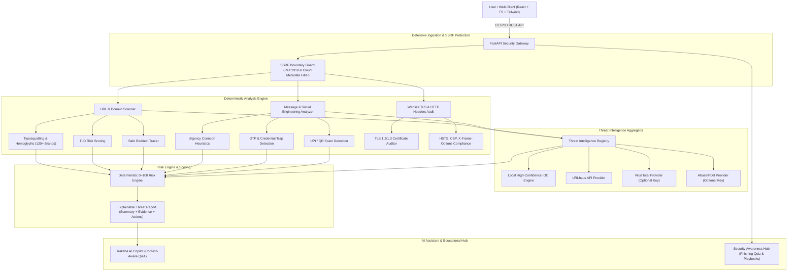

# 🛡️ RakshaSutra — Check Before You Click.
### AI-Powered Cybersecurity & Explainable Threat Detection Platform

> **Product:** RakshaSutra  
> **Tagline:** Check Before You Click.  
> **Category:** Cybersecurity / Threat Intelligence / Security Awareness  
> **Core Principle:** *"Don't just tell the user that something is dangerous. Explain WHY."*

---

## 🌟 Overview & Philosophy

**RakshaSutra** is a production-grade defensive cybersecurity platform designed to protect users against phishing attempts, scam messages, malicious websites, credential harvesters, and social engineering attacks.

Unlike black-box scanners that output binary "Safe/Unsafe" labels, RakshaSutra delivers:
$$\text{Input Vector} \longrightarrow \text{Risk Score (0–100)} \longrightarrow \text{Risk Tier} \longrightarrow \text{Observable Evidence} \longrightarrow \text{Plain-Language Explanation} \longrightarrow \text{Defensive Action}$$

### Key Guarantees
1. **Never Claims "100% Safe":** Low-risk targets are reported accurately as verified clean while reinforcing active vigilance.
2. **SSRF-Hardened Network Layer:** Blocks RFC1918 private subnets, loopbacks, link-local addresses, carrier NAT, cloud metadata endpoints (`169.254.169.254`), and internal machine names with pre-socket and post-DNS resolution validation.
3. **Deterministic Multi-Signal Engine:** Combines Levenshtein distance, Jaro-Winkler homoglyphs, Punycode analysis, TLD reputation matrix, and multi-engine threat intelligence (URLhaus, VirusTotal, AbuseIPDB, Local IOCs).
4. **Multi-Channel Social Engineering Detection:** Identifies urgency coercion, utility disconnection threats, OTP/credential traps, and marketplace UPI fraud across SMS, WhatsApp, Email, and Telegram.
5. **Interactive Security Copilot (Raksha AI):** Explains scan findings in plain language and triggers guided incident containment playbooks.

---

## 🏛️ System Architecture



---

## 🚀 Quickstart & Installation

### Prerequisites
- Python 3.10+ (tested on Python 3.14)
- Node.js 18+ (with `npm`)

### 1. Backend Setup
```bash
cd backend
python -m venv venv
# Windows:
venv\Scripts\activate
# Linux/macOS:
source venv/bin/activate

pip install -r requirements.txt
```

### 2. Frontend Setup
```bash
cd ../frontend
npm install
```

### 3. Launch Application

**Start Backend Server:**
```bash
cd backend
venv\Scripts\uvicorn.exe app.main:app --reload --host 127.0.0.1 --port 8000
```

**Start Frontend Development Server:**
```bash
cd frontend
npm.cmd run dev
```

Open browser at `http://localhost:5173`.

---

## 🔑 Default Demo Credentials

| Role | Email | Password |
| :--- | :--- | :--- |
| **System Administrator** | `admin@rakshasutra.org` | `Admin@Raksha2026!` |

*(Can also register any new account instantly via the UI)*

---

## 🧪 Automated Testing & Verification

Run the full automated pytest suite (14 unit/integration tests):
```bash
cd backend
venv\Scripts\pytest.exe -v
```

Run the live end-to-end audit verification script:
```bash
cd backend
venv\Scripts\python.exe scripts/verify_live.py
```

Build the production frontend bundle:
```bash
cd frontend
npm.cmd run build
```

---

## 📁 Project Structure

```
Rakshasutra/
├── backend/
│   ├── app/
│   │   ├── api/v1/          # REST endpoints (auth, scans, intel, ai, awareness, dashboard, admin)
│   │   ├── core/            # Config, security (bcrypt/JWT), database, SSRF filter, structured logging
│   │   ├── models/          # SQLAlchemy DB models (User, Scan, ThreatIndicator, SecurityEvent, etc.)
│   │   ├── schemas/         # Pydantic v2 validation models
│   │   ├── scanners/        # Typosquatting, domain, URL, message, website, risk engine
│   │   ├── services/        # Raksha AI copilot, awareness service, incident playbooks
│   │   ├── threat_intel/    # Provider abstraction (URLhaus, VirusTotal, AbuseIPDB, LocalDB)
│   │   └── main.py          # FastAPI application entrypoint with security middleware
│   ├── scripts/             # Live verification & audit scripts
│   ├── tests/               # 14 pytest test cases (SSRF, scanners, auth, API)
│   ├── pytest.ini
│   └── requirements.txt
│
└── frontend/
    ├── src/
    │   ├── components/      # RiskBadge, RiskGauge, ThreatIndicatorCard, Navbar, Footer, ScanReportView
    │   ├── context/         # AuthContext (JWT session management)
    │   ├── pages/           # Landing, URLScanner, MessageAnalyzer, WebsiteAudit, ThreatIntel, RakshaAI, Awareness, Dashboard, History, Admin, Login, Register
    │   ├── services/        # Typed API service client
    │   ├── types/           # TypeScript interface definitions
    │   ├── App.tsx          # Application shell & navigation router
    │   ├── index.css        # Cyber theme styling & custom scrollbars
    │   └── main.tsx
    ├── index.html
    ├── package.json
    ├── tailwind.config.js
    └── vite.config.ts
```

---

## 🛡️ Defensive Capabilities Summary

- **URL Typosquatting Detection:** 120+ brands covered (SBI, HDFC, ICICI, PayPal, Google, Microsoft, Apple, Amazon, Netflix, Netflix, Flipkart, etc.) using Levenshtein distance, Jaro-Winkler similarity, and Punycode homoglyph decoding.
- **SSRF Boundary Enforcement:** Hardened against private subnets (RFC1918, RFC6598, link-local, loopback, cloud metadata `169.254.169.254`) with socket pre-flight checks and dual-stage DNS resolution.
- **Multi-Vector Message Analyzer:** Parses urgency coercion phrases, utility disconnection threats, OTP/credential harvesting keywords, and embedded link unmasking.
- **Passive Website Security Audit:** Evaluates TLS certificates, HSTS, Content-Security-Policy (CSP), X-Frame-Options, X-Content-Type-Options, and Referrer-Policy into letter hygiene grades (A+ to F).
- **Incident Response Playbooks:** Interactive step-by-step guidance for *Clicked Phishing Link*, *Shared OTP / Password*, and *Suspected Account Takeover*.
- **Security Awareness Hub:** Interactive phishing simulation quizzes with immediate pedagogical rationale and actionable cyber hygiene checklists.
